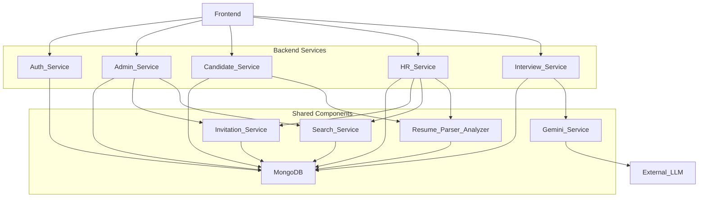

# Backend Service Interconnections

## Overview
The LLM Interviewer backend is designed as a microservices architecture, with distinct services handling specific domains: Authentication, Administration, Candidate operations, HR operations, and Interview management. These services interact with each other and shared resources to provide the full platform functionality.

## Services and Their Roles
- **Auth Service:** Manages user registration, login, and authentication/authorization via JWT tokens. It is the entry point for user access.
- **Admin Service:** Handles platform-level administration, including user management (excluding other admins), system statistics, and the HR-Admin mapping process from the Admin's perspective.
- **Candidate Service:** Provides functionalities specific to candidates, such as profile management, resume upload, and accessing their interview and messaging data.
- **HR Service:** Provides functionalities specific to HR personnel, including profile management, applying for/managing Admin mapping, searching candidates, viewing assigned candidates, and messaging candidates.
- **Interview Service:** Manages the core interview workflow, including scheduling, question generation, response submission, result processing, and AI evaluation integration.

## Key Interconnections and Data Flows

1.  **Frontend to Services:**
    - The frontend application interacts with all backend services via their respective API endpoints (e.g., `/api/v1/auth`, `/api/v1/admin`, `/api/v1/candidate`, `/api/v1/hr`, `/api/v1/interview`).
    - JWT tokens obtained from the Auth Service are included in requests to other services for authentication and authorization.

2.  **Auth Service and Other Services:**
    - All other services rely on the Auth Service's authentication mechanism. They typically use a dependency (like `get_current_active_user`) that validates the JWT token in the request header and retrieves the authenticated user's information (ID, role) from the token payload or by querying the database via the Auth Service's logic.
    - The Auth Service is the primary service writing to the `users` collection in MongoDB during registration and password reset.

3.  **Services and MongoDB:**
    - All services interact directly with the shared MongoDB database.
    - The `users` collection is accessed by most services to retrieve user information, check roles/statuses, and update user-specific fields (e.g., `mapping_status`, `hr_status`, `assigned_hr_id`, `resume_path`).
    - The `hr_mapping_requests` collection is primarily managed by the Admin and HR services via the `InvitationService`.
    - The `interviews` and `responses` collections are primarily managed by the Interview Service, but the Candidate and HR services read from them to display relevant information. The Candidate Service also writes to the `responses` collection.
    - The `questions` collection is read by the Interview Service.
    - The `messages` collection is written to by the HR Service (sending messages) and read/updated (read status) by the Candidate Service.

4.  **Admin Service and User Data:**
    - The Admin Service reads and updates user data in the `users` collection for administrative purposes (listing, activating/deactivating, deleting non-admins).
    - It interacts with the `hr_mapping_requests` collection to manage the HR mapping workflow.

5.  **Candidate Service and User/Interview/Message Data:**
    - The Candidate Service reads and updates the candidate's own user document (`users` collection).
    - It writes resume data (`resume_path`, `resume_text`, extracted info) to the candidate's user document.
    - It reads interview data (`interviews` collection) and response data (`responses` collection) relevant to the current candidate.
    - It writes candidate answers to the `responses` collection.
    - It reads and updates message data (`messages` collection) relevant to the current candidate.

6.  **HR Service and User/Candidate/Interview/Message Data:**
    - The HR Service reads and updates the HR's own user document (`users` collection).
    - It interacts with the `hr_mapping_requests` collection (via `InvitationService`) to manage the HR-Admin mapping process from the HR's side.
    - It reads candidate data (`users` collection) for searching and viewing assigned candidates (via `SearchService`).
    - It writes messages to the `messages` collection for candidates.
    - It interacts with the Interview Service's API to schedule interviews and submit results/feedback.

7.  **Interview Service and LLM/User/Response Data:**
    - The Interview Service reads user data (`users` collection) to validate candidate status and HR assignments during scheduling.
    - It reads question data (`questions` collection) and interacts with the Gemini Service for question generation.
    - It writes new interview documents to the `interviews` collection.
    - It reads and writes candidate responses to the `responses` collection.
    - It interacts with the Gemini Service for AI evaluation of responses.
    - It updates interview documents (`interviews` collection) with completion status and overall results.

8.  **Shared Services/Modules:**
    - **MongoDB:** Central data store for all services.
    - **Resume Parser/Analyzer:** Likely shared utility modules used by both Candidate and HR services for processing resumes.
    - **Invitation Service:** Shared logic used by Admin and HR services for managing mapping requests/applications.
    - **Search Service:** Shared logic used by Admin and HR services for searching users (HRs or Candidates).
    - **Gemini Service:** Shared logic used by the Interview Service for LLM interactions.
    - **Core Utilities:** Shared modules for configuration, security (JWT handling, password hashing), and database connection.

## Diagram (Conceptual)

This diagram illustrates the main services, shared components, and the primary directions of interaction between them and the frontend/external LLM.